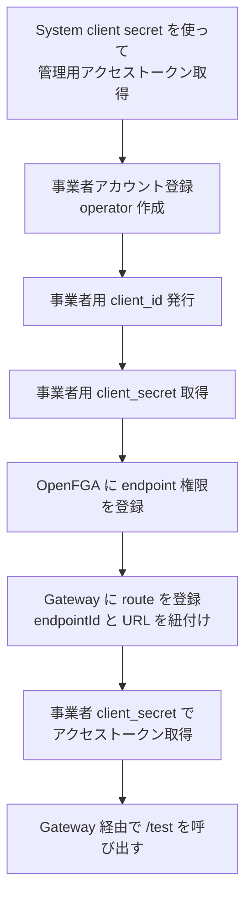

# ODS のチュートリアル流れ

事業者を登録し、Gateway 経由で API を呼び出すまでの流れを示します。

```mermaid
flowchart TD
    A[System client secret を使って<br>管理用アクセストークン取得]
    B[事業者アカウント登録<br>operator 作成]
    C[事業者用 client_id 発行]
    D[事業者用 client_secret 取得]
    E[OpenFGA に endpoint 権限を登録]
    F[Gateway に route を登録<br>endpointId と URL を紐付け]
    G[事業者 client_secret で<br>アクセストークン取得]
    H[Gateway 経由で /test を呼び出す]

    A --> B --> C --> D --> E --> F --> G --> H
```